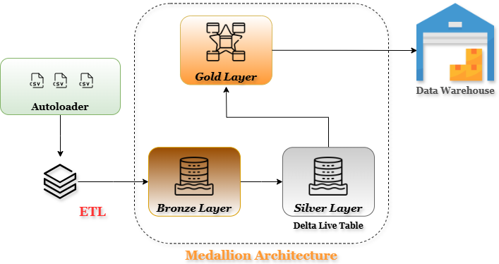

# End-to-End Data Engineering Pipeline with Databricks & DBT

This project demonstrates a complete real-time data pipeline built using **Databricks**, **PySpark**, **Delta Lake**, and **DBT**. It ingests streaming data, applies transformations, enforces data quality rules, and tracks historical changes.

## 🔧 Tech Stack
- Databricks (Notebooks, Jobs, Workflows, DLT)
- PySpark for streaming & transformations
- Delta Lake with bronze-silver-gold architecture
- DBT for modular SQL modeling
- Databricks Autoloader for scalable ingestion
- Delta Live Tables for data quality & schema enforcement

## 🧩 Features
- Real-time data ingestion from cloud storage
- Structured streaming transformations with PySpark
- Data quality checks with Delta Live Tables
- SCD Type 2 implementation for historical tracking
- Modular transformations using DBT
- Automated orchestration with Databricks Jobs

## 📷 Pipeline Architecture

